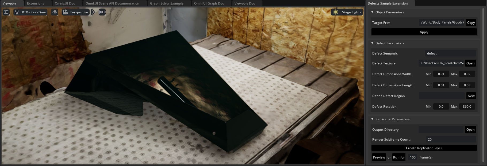

# Defect Extension Sample



### About

This extension allows user's to generate a single defect on a target prim using images to project the defect onto the prim. Using Replicator's API the user can generate thousands of synthetic data to specify the dimensions, rotation, and position of the defect.


### [README](exts/omni.example.defects)
See the [README for this extension](exts/omni.example.defects) to learn more about it including how to use it.

## Adding This Extension

This folder is ready to be pushed to any git repository. Once pushed direct link to a git repository can be added to *Omniverse Kit* extension search paths.

Link might look like this: `git://github.com/NVIDIA-Omniverse/kit-extension-sample-defects?branch=main&dir=exts`

Notice `exts` is repo subfolder with extensions. More information can be found in "Git URL as Extension Search Paths" section of developers manual.

To add a link to your *Omniverse Kit* based app go into: Extension Manager -> Gear Icon -> Extension Search Path


## Linking with an Omniverse app

If `app` folder link doesn't exist or broken it can be created again. For better developer experience it is recommended to create a folder link named `app` to the *Omniverse Kit* app installed from *Omniverse Launcher*. Convenience script to use is included.

Run:

```
> link_app.bat
```

If successful you should see `app` folder link in the root of this repo.

If multiple Omniverse apps is installed script will select recommended one. Or you can explicitly pass an app:

```
> link_app.bat --app create
```

You can also just pass a path to create link to:

```
> link_app.bat --path "C:/Users/bob/AppData/Local/ov/pkg/create-2021.3.4"
```


# Contributing
The source code for this repository is provided as-is and we are not accepting outside contributions.
